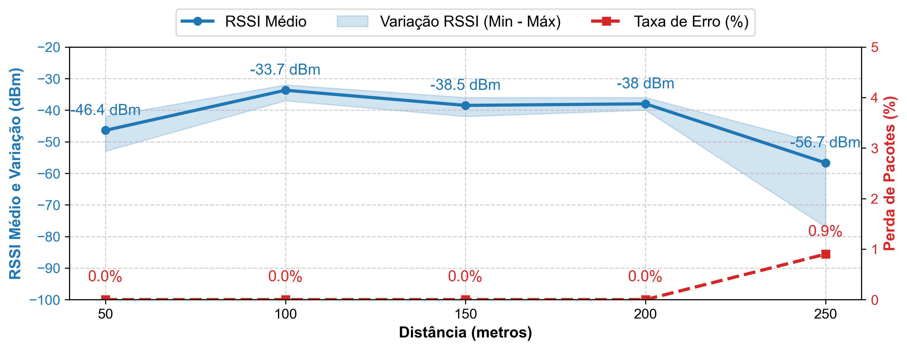
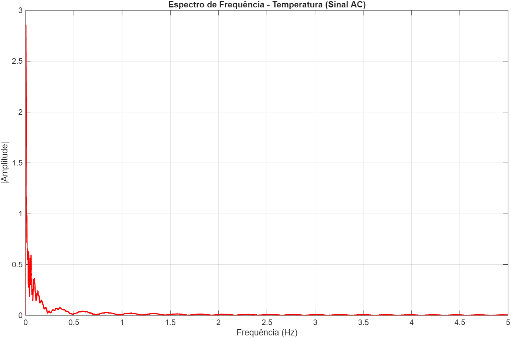
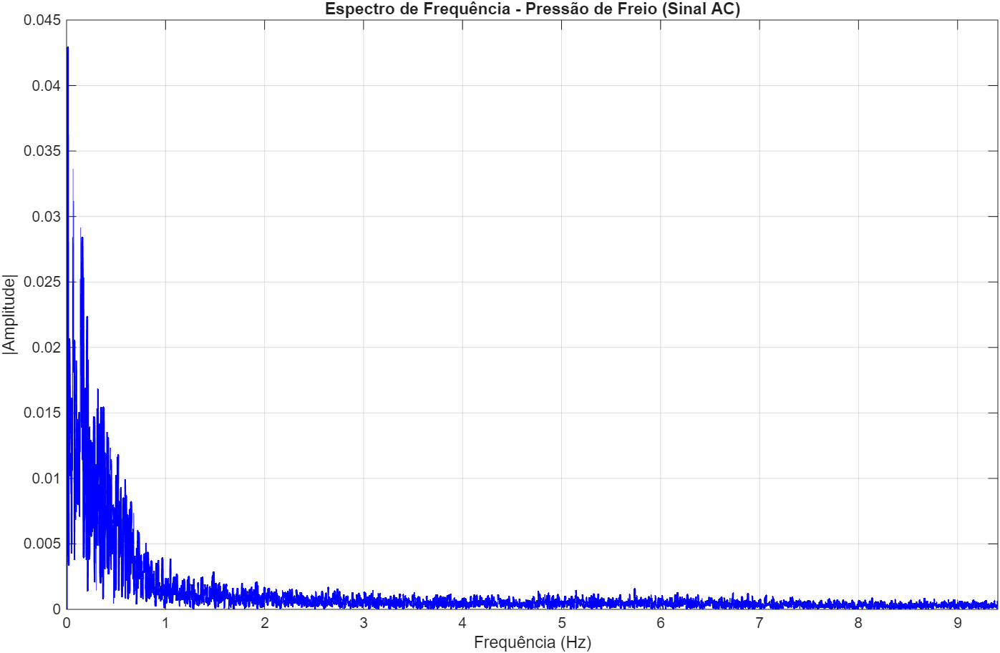

# TR08 Telemetry System
Telemetry and DAQ System for FSAE BR Team TEC Racing

# Resultados da Pesquisa:

## Desempenho da Comunicação a Distância:

 Para avaliar a performance do sistema, foi construído um protótipo com os componentes principais e foi realizado um teste de comunicação, consistindo no envio de 1.000 mensagens para o Sistema Receptor em distâncias predefinidas, variando de 50 m a 250 m, com incrementos regulares de 50 metros. O Sistema Receptor identifica quantas mensagens foram recebidas e informa a potência do sinal recebido para cada mensagem e porcentagem de erro total.

 A análise da métrica do Indicador de Potência do Sinal Recebido, RSSI, demonstra que o sinal médio atenuou de -46,4 dBm, a 50 metros, para -56,7 dBm, a 250 metros. Esses valores encontram-se em uma zona extremamente segura de recepção. De acordo com a literatura técnica e as especificações da fabricante do transceiver, a modulação LoRa apresenta uma sensibilidade de recepção que pode atingir o limite de até -148 dBm, dependendo dos parâmetros configurados. Como resultado direto da robustez da modulação LoRa, a taxa de erro manteve-se estritamente nula até os 200 metros de distância, registrando uma taxa ínfima de descarte de apenas 0,9% ao atingir o limite de 250 metros. Esses dados validam a arquitetura de comunicação escolhida, comprovando sua capacidade técnica de manter a telemetria do protótipo funcional nas maiores distâncias encontradas entre os boxes e a pista do autódromo ECPA. 

## Modelagem de Filtros:

 A modelagem dos filtros digitais, FIR e IIR, para os sensores do Sistema Transmissor, compreendendo a temperatura da água do radiador (entrada e saída) e a pressão da linha de freio traseira, foi realizada no ambiente MATLAB. Como os referidos instrumentos ainda não haviam sido instalados, a análise espectral utilizou dados de telemetria pregressos, capturados pela ECU a uma taxa de amostragem de 18,81 Hz. Dessa forma, assumiu-se o comportamento térmico da água do motor como referência para o radiador, e a dinâmica da linha de freio dianteira para parametrizar o circuito traseiro. Através da Transformada Rápida de Fourier (FFT), constatou-se que a energia do sinal de temperatura concentra-se predominantemente abaixo de 0,3 Hz. Diante disso, estabeleceu-se uma frequência de passagem de 0,5 Hz e uma frequência de rejeição de 2 Hz, o que resultou na síntese de um filtro IIR de 5ª ordem e um FIR de 14ª ordem. De maneira análoga, a FFT do sinal de pressão de freio fundamentou a escolha de 1,5 Hz para a banda de passagem e 4 Hz para a banda de rejeição, gerando filtros IIR e FIR, ambos de 3ª ordem. 

### Espectro de Frequência - Temperatura da Água:

### Espectro de Frequência - Pressão de Freio:

Testou-se computacionalmente a aplicação dos filtros FIR e IIR modelados no MATLAB. Verificou-se que os filtros IIR atingiram um desempenho de atenuação de ruído de alta frequência estatisticamente semelhante aos filtros FIR de maior ordem. Devido a essa similaridade de eficiência atrelada a uma considerável redução da complexidade algorítmica e custo computacional, a topologia IIR foi selecionada e implementada de forma definitiva no código receptor.

## PCB:

## Dashboard:
